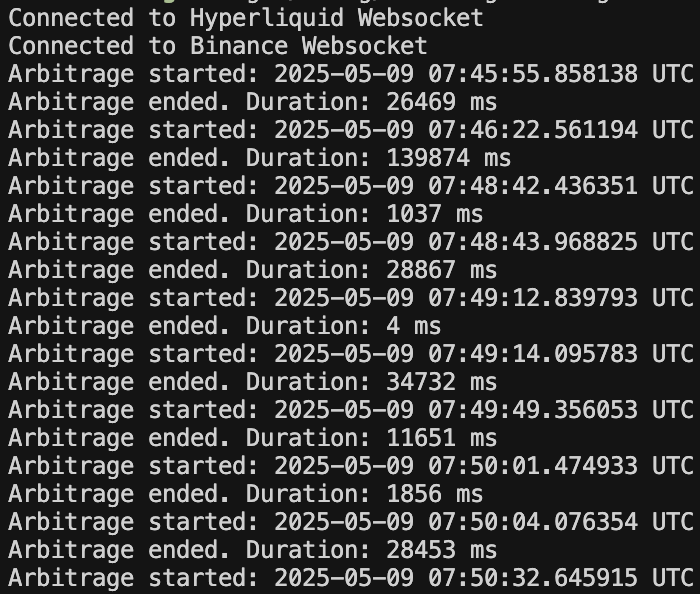

# USAGE
1. Clone the repo to use it locally with `git clone https://github.com/pbht/arbitrage-timer.git`
2. cd into the repo with `cd arbitrage-timer`
3. Build with `cargo build --release`
4. Run with `./target/release/arbitrage-timer --exchanges EXCHANGE1 EXCHANGE2 --ticker TICKER` to use the default value for the arbitrage threshold, 0.5%. This can be specified with the `--threshold THRESHOLD` flag. For example, `--threshold 0.01` times how long an arbitrage of over 1% exists. Currently, the script accepts exchange inputs of `hyperliquid` and `binance`.

# EXAMPLE
`./target/release/arbitrage-timer --exchanges hyperliquid binance --ticker ETH`

# OUTPUT

# TODO
- [ ] Auto-reconnection logic in case of connection closing
- [ ] Sending Pong responses to Pings to prevent disconnection
- [ ] More robust input validation
- [ ] Storage of arbitrage timings to calculate statistics such as mean and variance
- [ ] Support for more exchanges including MEXC, Gate.io, Kucoin, Bitget, Bybit
- [ ] Scan multiple pairs