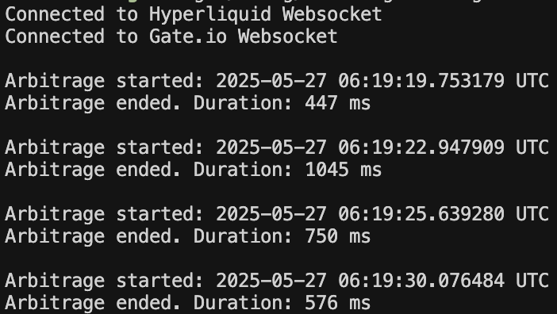

# BACKGROUND
The objective of this script is to time how long arbitrages above a certain threshold exist for an asset accross some specified exchanges. The goal of this is to identify which assets have arbitrage opportunities open for the longest time and target those. For my personal coding development, this was an exercise in bringing together ideas which I have covered separately into a sophisticated and useful program. Namely, I wanted to interact with websockets, spawn multiple asynchronous processes, and utilise a more object-oriented design than I am used to. I have organised the file structure to allow for the easy extension of the script to new exchanges. 

# USAGE
1. Clone the repo to use it locally with `git clone https://github.com/pbht/arbitrage-timer.git`
2. cd into the repo with `cd arbitrage-timer`
3. Build with `cargo build --release`
4. Run with `./target/release/arbitrage-timer --exchanges EXCHANGE1 EXCHANGE2 --ticker TICKER` to use the default value for the arbitrage threshold, 0.5%. This can be specified with the `--threshold THRESHOLD` flag. For example, `--threshold 0.01` times how long arbitrage opportunities of over 1% exist.
   
The script currently accepts the following exchange inputs: 
- `hyperliquid`
- `binance`
- `gate-io`

# EXAMPLE
`./target/release/arbitrage-timer --exchanges hyperliquid gate-io --ticker ETH --threshold 0.0005`

Gave us the output: \

# TODO
- [ ] Auto-reconnection logic in case of connection closing
- [ ] Send Pong responses to Pings to prevent disconnection
- [x] More robust input validation (only allows valid exchanges for inputs) 
- [ ] Error handling for invalid tickers - need to define custom error types and handle different errors independently
- [ ] Storage of arbitrage timings to calculate statistics such as mean and variance
- [ ] MEXC support
- [x] Gate.io support
- [ ] Kucoin support
- [ ] Bitget support
- [ ] Bybit support
- [ ] Scan multiple pairs concurrently
